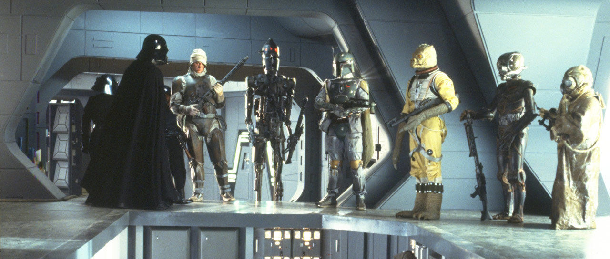

  

<h1 align="center">
  Fan app by: Michael Saucedo
</h1>

In this project I use React.js in conjunction with Tailwind CSS. I use a Star Wars type of feel just for getting ideas on how to mix patterns and thoughts that come to mind. I chose The Empire Strikes Back bountyhunters as a way to showcase some of the ways to mix Tailwind and React Router Dom. I also use ESLint with the airbnb config along with Prettier code formatter. Also with Husky to run lint-staged befor GitHub commit. [Visit Site](https://bountyhunters.netlify.app/)

## 🧐 What's inside?

A quick look at the pages you'll see in this React with Tailwind project.

1.  **`/FourLOM`**: 4-LOM and starship Mist Hunter

2.  **`/Bossk`**: Bossk and starship Houndstooth

3.  **`/BobaFett`**: Boba Fett and starship Slave I

4.  **`/IG88`**: IG-88B and starship IG-2000

5.  **`/Zuckuss`**: Zuckuss and starship Mist Hunter

6.  **`/Dengar`**: Dengar and starship Jumpmaster 5000
